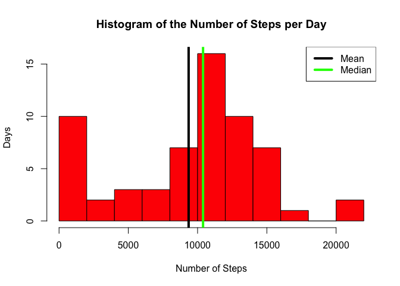
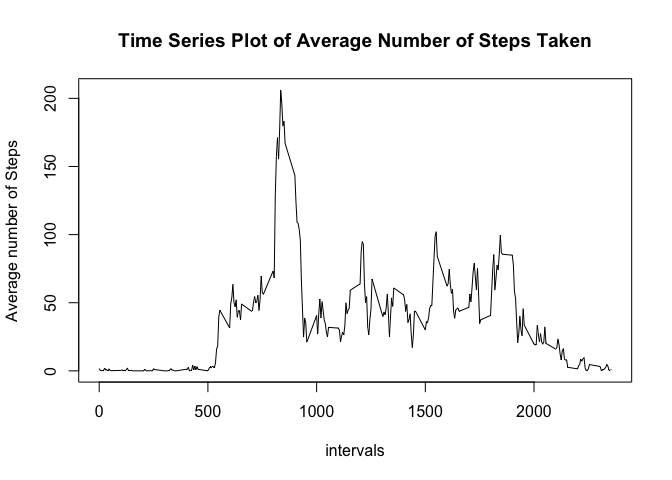
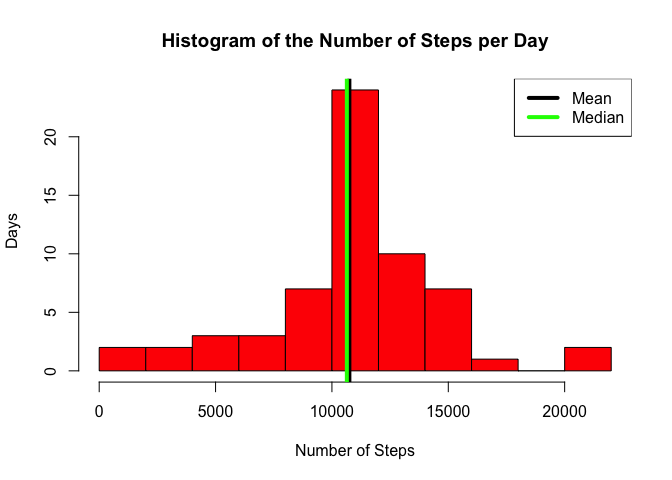
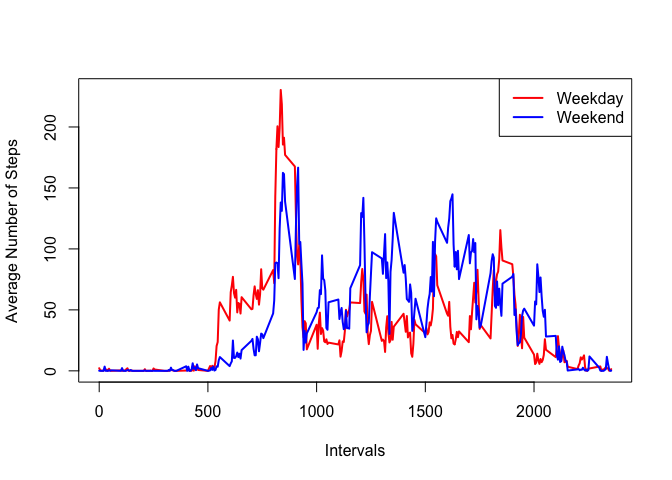

# Reproducible Research: Peer Assessment 1

## Loading and preprocessing the data


```
##   steps       date interval
## 1    NA 2012-10-01        0
## 2    NA 2012-10-01        5
## 3    NA 2012-10-01       10
## 4    NA 2012-10-01       15
## 5    NA 2012-10-01       20
## 6    NA 2012-10-01       25
```

## What is mean total number of steps taken per day?

To get a summary of the number of steps the user have per day, use aggregate() function  

```r
daily.data <- aggregate(activity.data$steps, list(activity.data$date),sum, na.rm = T)
```

Then, we can plot the histogram of the user's number of steps per day, the mean and median are plotted on the histograms and a summary of the statistics are provided below the histogram  

```r
hist(daily.data[,2], xlab = "Number of Steps", ylab = "Days", breaks = 15, 
     main = "Histogram of the Number of Steps per Day",col = "RED")
with(abline(v = mean(daily.data[,2]), col = "BLACK", lwd = 4), 
     abline(v = median(daily.data[,2]), col = "GREEN", lwd = 4))
legend("topright", lty = c(1,1), col = c("BLACK","GREEN"), 
       lwd = c(4,4), legend = c("Mean", "Median"))
```

 


So, the mean is 9354, and the median is 10400.0

## What is the average daily activity pattern?

First, use aggregate function to find the average number of steps per one interval in the day  

```r
hourly.data <- aggregate(activity.data$steps, list(activity.data$interval), 
                         mean, na.rm = T)
```

Plot the hourly data  

```r
plot(hourly.data, type = "l", xlab = "intervals", ylab = "Average number of Steps", 
     main = "Time Series Plot of Average Number of Steps Taken")
```

 

```r
hourly.max <- hourly.data[which.max(hourly.data$x),1]
```

The maximum number of steps in the 5 minutes interval is on the interval 835  

## Inputing missing values

Calculating the number of missing values in the original datasets

There are 2304 missing values on the datasets 

To fill out this missing datasets, I am going to use the long-run average for the intervals to replace missing values

```r
hourly.data[,3] <- floor(hourly.data[,2])
activity.data.processed <- activity.data
for(i in 1:nrow(activity.data)){
  if(is.na(activity.data.processed[i,1])){
    activity.data.processed[i,1]<- hourly.data[
      hourly.data[,1]==activity.data.processed[i,3],3]
  }
}
```

```r
head(activity.data.processed)
```

```
##   steps       date interval
## 1     1 2012-10-01        0
## 2     0 2012-10-01        5
## 3     0 2012-10-01       10
## 4     0 2012-10-01       15
## 5     0 2012-10-01       20
## 6     2 2012-10-01       25
```

Here are the histogram of the newly processed data, with mean and median

```r
daily.data.processed <- aggregate(activity.data.processed$steps, 
                                  list(activity.data.processed$date),sum)
hist(daily.data.processed[,2], xlab = "Number of Steps", ylab = "Days", 
     breaks = 10, main = "Histogram of the Number of Steps per Day",col = "RED")
with(abline(v = mean(daily.data.processed[,2]), col = "BLACK", lwd = 4), 
     abline(v = median(daily.data.processed[,2]), col = "GREEN", lwd = 4))

legend("topright", lty = c(1,1), col = c("BLACK","GREEN"), 
       lwd = c(4,4), legend = c("Mean", "Median"))
```

 

For the newly processed datasets, the mean is 10749.8 and the median is 10641.0.  
We can see that now, the mean and the median is quite close to each other compared to the unprocessed, raw data.

## Are there differences in activity patterns between weekdays and weekends?


```r
weekday.vector<-data.frame(isWeekday(as.Date(activity.data.processed$date)))
activity.data.processed[,4] <- weekday.vector
names(activity.data.processed)[4] <- "is.weekday"
```
On the 4th column called "is. weekday", "TRUE" is for weekday and "FALSE" is for weekend.

```r
weekday.data <- activity.data.processed[
  activity.data.processed[,4]==TRUE,]
weekday.hourly.data <- aggregate(weekday.data$steps, list(weekday.data$interval), mean)
weekend.data <- activity.data.processed[
  activity.data.processed[,4]==FALSE,]
weekend.hourly.data <- aggregate(weekend.data$steps, 
                                 list(weekend.data$interval), mean)
plot(weekday.hourly.data, type = "l", lwd = 2, col = "RED", 
     xlab = "Intervals", ylab = "Average Number of Steps") 
lines(weekend.hourly.data, type = "l", lwd = 2, col = "BLUE")
legend("topright", lty = c(1,1), col = c("RED","BLUE"), lwd = c(2,2), 
       legend = c("Weekday", "Weekend"))
```

 

As you can see there are differences in the activity level in the weekend. Several things that are worth mentioning are:

* Generally, during weekend, the activity starts in a later interval at around 9 a.m compared to weekdays that start at around 5:30 a.m

* There are very little activity during weekdays between 9 a.m to 5 p.m mainly due to this during work-hours
